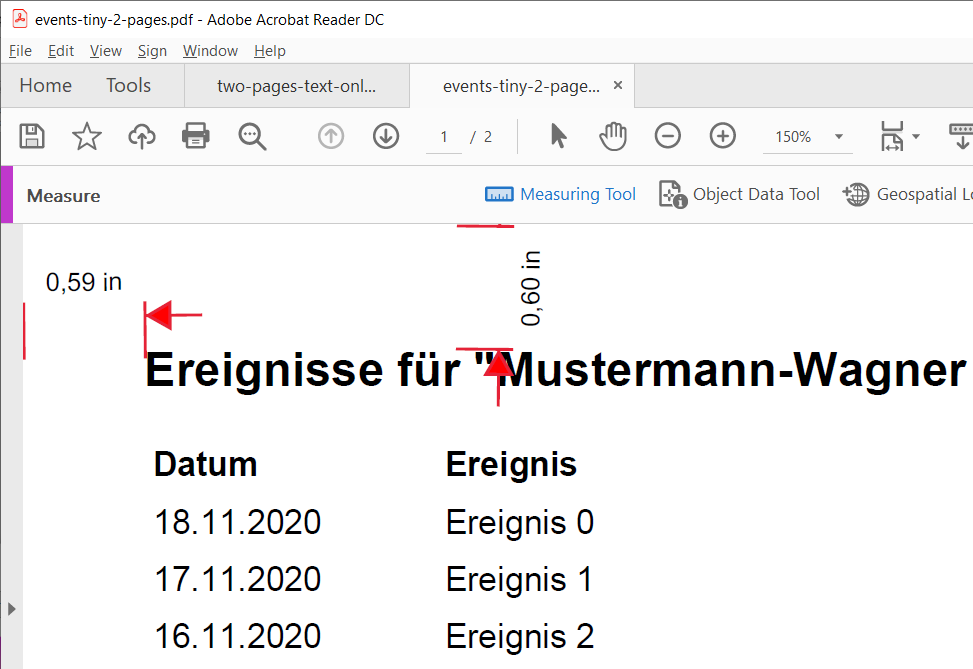
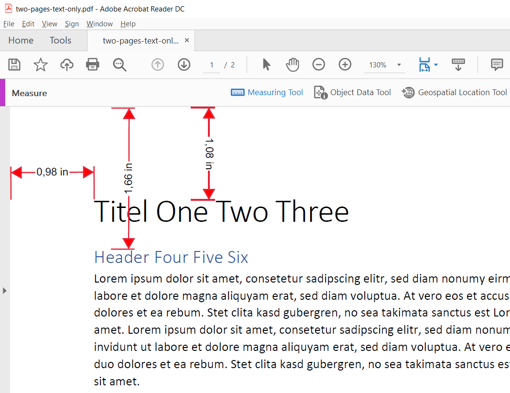

# PDF Assertion Test Project

## Build

```
mvn install:install-file -Dfile=libs/pdfunit-java-2016.05.jar -Djavadoc=libs/pdfunit-java-2016.05-javadoc.jar \
    -Dpackaging=jar -DgeneratePom=true -DgroupId=com.pdfunit -DartifactId=pdfunit -Dversion=2016.05
        
mvn test
```

## Tests

Siehe [PdfUnitTest.java](src/test/java/com/giraone/pdf/PdfUnitTest.java)

### Test 1 - test_with_generated_pdf

***Problem 1:***

Die auf einen A4-Ausdruck gemessenen Positionen passen nicht.



```java
File pdf = new File("src/test/resources/pdfs/events-tiny-2-pages.pdf");
// 15 mm = 2.54 * 0.60 ==> 10% Delta = 13mm
// 5 mm Höhe; 10% Toleranz ==> 7 mm

AssertThat.document(pdf)
    .restrictedTo(FIRST_PAGE)
    .restrictedTo(regionWithoutHeaderAndFooter)
    .hasText()
    .startingWith("Ereignisse")
    .containing("Mustermann-Wagner Annegret")
    .containing("08.12.1978");
```

```
Das Dokument 'C:\GIT\gir...st\src\test\resources\pdfs\events-tiny-2-pages.pdf' hat keinen Text im angegebenen Seitenausschnitt.
```

***Problem 2:***

Warnungen:

```
[      Finalizer] org.apache.pdfbox.cos.COSDocument        : Warning: You did not close a PDF Document
```

### Test 2 - test_with_large_text

***Problem 1:***

Die auf einen A4-Ausdruck gemessenen Positionen passen nicht.



```java
File pdf = new File("src/test/resources/pdfs/two-pages-text-only.pdf");
Assertions.assertAll(
() -> AssertThat.document(pdf)
.restrictedTo(FIRST_PAGE)
.restrictedTo(new PageRegion(25, 27, 185, 5)) // 25 mm = 0.98 inch * 2.54; 27 mm = 1.08 inch * 2,54
.hasText()
.containing("Titel"),
() -> AssertThat.document(pdf)
.restrictedTo(FIRST_PAGE)
.restrictedTo(new PageRegion(25, 42, 185, 3)) // 25 mm = 0.98 inch * 2.54; 2742 mm = 1.66 inch * 2,54
.hasText()
.containing("Header"),
```

Ergebnis:

```
Erwartet: 'Titel', gefunden: 'itel One Two Three'
```